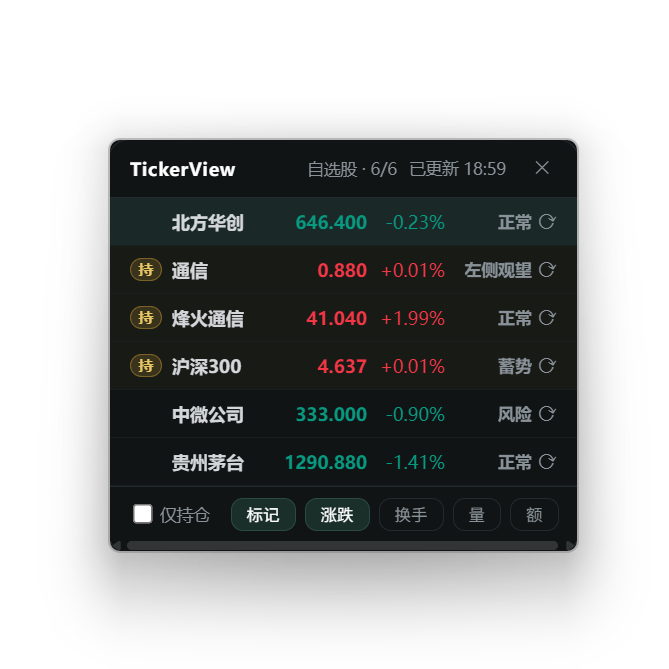
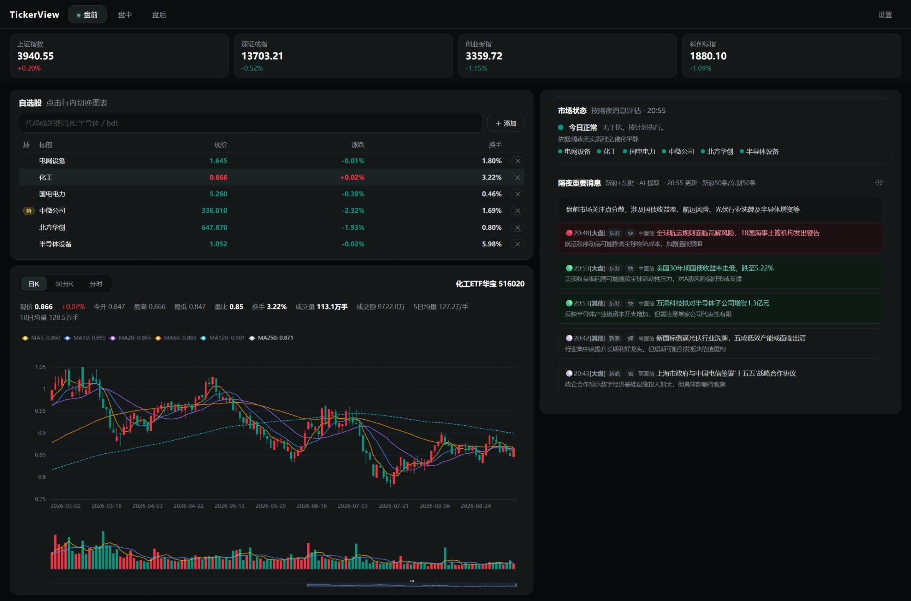
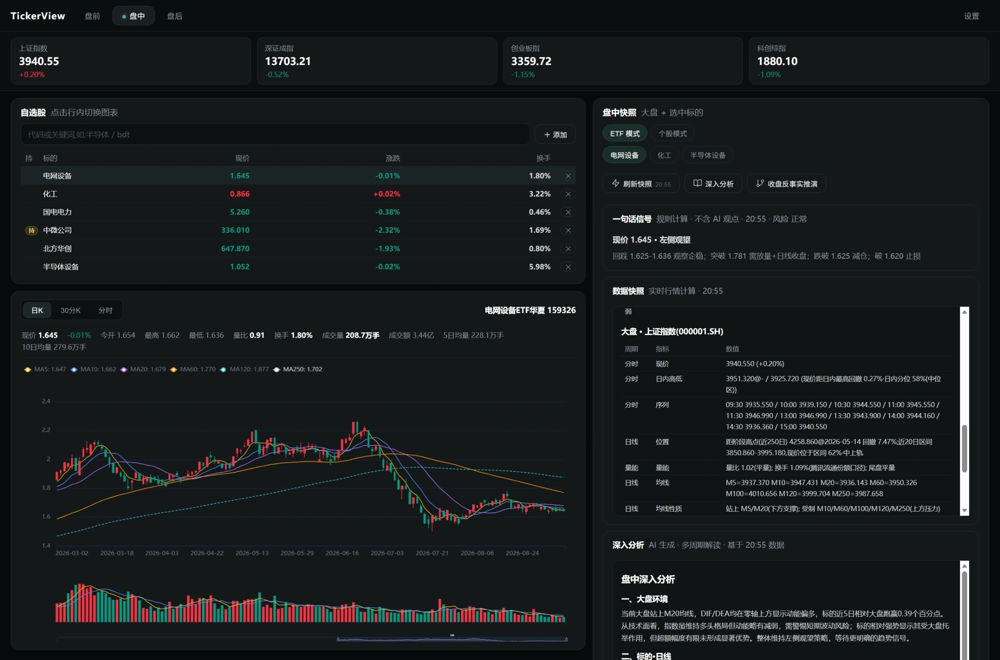
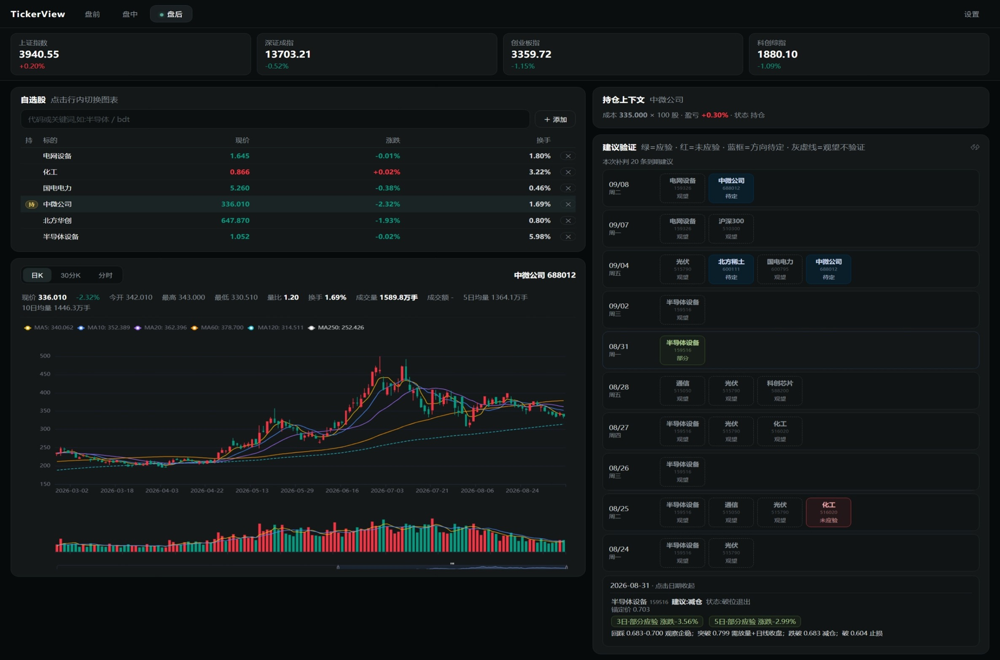

# TickerView

[简体中文](README.md) · **English**

> An **AI-assisted market monitor and decision-support system** for A-share investors.
> An engine that computes precisely, an AI that explains clearly — and **you always make the call**. No auto-trading.

<p>
  
  
  
  
</p>

---

## At a glance

**Desktop floating panel** — a borderless, always-on-top mini window in the system tray; live quotes at a glance without interrupting whatever you're doing:



**Web dashboard** — pre-market · intraday · post-market in one browser page:

| Pre-market · News & state light | Intraday · ETF/stock deep analysis | Post-market · Verification calendar |
|---|---|---|
|  |  |  |

## Why this exists

Retail monitoring pain is concrete:

- **Information overload**: a dozen symbols on the watchlist, endless news flashes, and the items that matter drown in noise;
- **Nobody checks the receipts**: "AI stock pickers" produce opinions daily but never look back at whether they were right — you can't tell skill from luck;
- **AI tools you can't trust**: black-box judgments can't be verified, and models will invent prices with a straight face.

TickerView's answer: **make the ledger visible**. Information aggregated for you, discipline nudged for you — and **every directional judgment is automatically reconciled days later, with the scorecard sitting right on the calendar**. You don't have to trust me; read the ledger.

## What it does for you each day

### Pre-market · "Is anything happening today?" in one minute

Open it in the morning: a hundred-plus market flashes have been filtered by AI into **5–8 items that actually matter**, each tagged bullish/bearish, related sector and confidence. The state light 🟢🟡🔴 at the top tells you whether today is a day to act or to sit — a red light only nudges "hold off, don't open new positions"; **it never touches your stop-losses and never decides anything for you**.

### Intraday · Understand a symbol at a glance

Hit "refresh snapshot" on an ETF or stock in your watchlist: the engine computes MA relationships, volume ratio and key levels, and a **one-line signal** tells you its state and the corresponding action tier.

Want the full read? "Deep analysis" hands over to the AI — **writing its interpretation from the numbers the engine just computed**: every price traceable, nothing invented; if the model misbehaves, layered validation bounces it. **What you read is either accurate or absent — never "plausible-sounding nonsense"**. ETFs also support **counterfactual reasoning**: "what happens if it breaks X?" — answered by rule-based extrapolation, not model imagination.

Stocks take a deliberately different route: **risk flags only, never buy/sell advice** — escalating tiers nudge you to trim and stay alert, but the tool will never tell you "it's time to buy". That call stays yours.

### Post-market · Every piece of advice gets a scorecard

This is where TickerView differs from every "AI stock picker": **each directional advice given intraday is auto-judged "verified / partially verified / not verified" after 3 / 5 trading days**.

Open the verification calendar and the last 90 days of advice are laid out — whether this tool has been any good lately isn't something I tell you; it's right there in the ledger. Fully local, zero push notifications.

## 🧠 Why the AI content here is trustworthy

Three design choices make every AI output defensible:

1. **The AI translates; it doesn't compute** — every number comes from a reproducible engine, and the AI's job is to turn facts into plain language. It produces no prices, does no grading, makes no decisions.
2. **Every number has a source** — prices in AI output must trace back to the engine snapshot; anything else is treated as fabrication and bounced. Directional words and state words are whitelist-locked. **Say less rather than say wrong**.
3. **If the model dies, the app doesn't** — multi-model automatic failover; if everything fails, it degrades to keyword filtering, then to the raw feed (clearly labeled "not AI-filtered"). **No single point of failure interrupts the product or fabricates content.**

In one line: **the AI's boundary is crystal clear — it saves you time, and you keep full authority over your own judgment**.

## Real-time monitoring (the basics)

- SSE / SZSE / ChiNext index snapshots + live watchlist quotes (price / change / turnover / volume ratio)
- Daily / 30-min candlesticks with MAs; intraday chart (with average-price line), volume sub-chart
- Holdings highlighting; A-share convention **red = up, green = down**
- Floating panel / web dashboard / tray — all data from the same source

## Data sources

All from public data sources; the tool **connects to no trading account and places no orders**:

- Real-time quotes / indices / intraday: Tencent market data, Tonghuashun (10jqka) snapshots
- Daily / 30-min K-line: Tencent market API (supplemented by akshare)
- News flashes: Sina Finance 7×24, EastMoney
- Sector moves / hot lists: Tonghuashun (10jqka)

## 📦 Install (end users)

1. Go to **[Releases](../../releases)** and download `TickerView-Setup-0.1.0.exe`
2. Double-click to install — **per-user, no administrator rights required**; defaults to `%LOCALAPPDATA%\Programs\TickerView` (changeable, e.g. to D:)
3. A "TickerView" entry appears in the Start menu / desktop; the app lives in the **system tray**

**Requirements**: Windows 10 / 11 (64-bit). Win11 ships WebView2; most Win10 machines already have it via Edge, and the installer also bootstraps it.

<details>
<summary>SmartScreen prompt on first run?</summary>

This project is not code-signed (paid certificate), so the first run may show "Windows protected your PC / unknown publisher". Click **More info → Run anyway**.

</details>

**Where your data lives**: config and database are stored under `%APPDATA%\TickerView\`. **Uninstalling keeps your data**; reinstalling picks it right up. A fresh install starts with an empty watchlist — add your own symbols.

> The desktop app provides **real-time monitoring and signals out of the box**; pre-market news filtering and intraday AI deep analysis need LLM keys configured in Settings (free-tier models supported, multi-provider failover built in).

## 🔨 Run from source (developers)

```bash
pip install -r requirements.txt        # Python 3.11+

python scripts/cli.py panel            # Desktop floating panel (auto-starts local server + tray)
python scripts/cli.py web              # Or the pure web dashboard (http://127.0.0.1:8765)
```

Data fetching, signals and the backtesting engine live in `scripts/cli.py` subcommands (`daily` / `signal`, etc.). LLM keys go in `config/settings.local.yaml` (gitignored). The backtesting engine is calibrated trade-by-trade against JoinQuant (< 1% P&L error) for researchers who want to reproduce conclusions.

**Tech stack**: Python · Flask · SQLite · Vue 3 · ECharts · pywebview · PyInstaller + Inno Setup · automatic failover across free LLMs (akshare / TA-Lib for data and indicators)

## 🔒 Data & privacy

- Fully local — **no account, no telemetry, nothing uploaded**
- Model keys, watchlist and database stay on your own machine

## ⚠️ Disclaimer

- This is a **research / personal tool** and does not constitute investment advice; market data may be delayed or inaccurate — rely on official disclosures
- **No auto-trading** — you execute every trade and bear the risk. Markets carry risk; decide carefully

## License

[MIT](LICENSE) © 2026 Mirenth

Third-party licenses are listed in [ATTRIBUTIONS.md](ATTRIBUTIONS.md).
